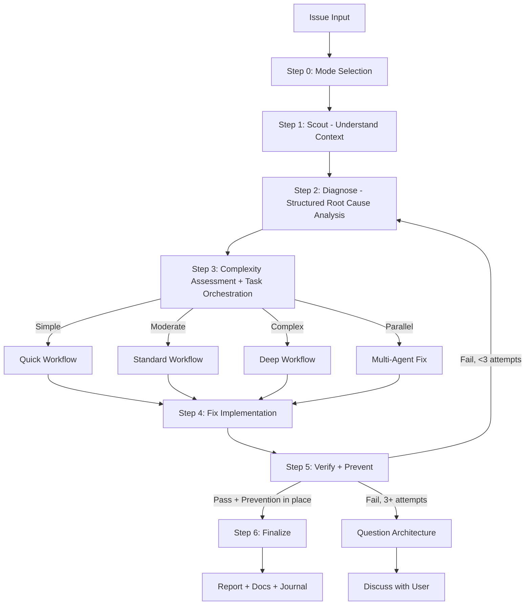

# Fixing

Unified skill for fixing issues of any complexity with intelligent routing.

## Arguments

- `--auto` - Activate autonomous mode (**default**)
- `--review` - Activate human-in-the-loop review mode
- `--quick` - Activate quick mode
- `--parallel` - Activate parallel mode: route to parallel `fullstack-developer` agents per issue

<HARD-GATE>
Do NOT propose or implement fixes before completing Steps 1-2 (Scout + Diagnose).
Symptom fixes are failure. Find the cause first through structured analysis, NEVER guessing.
If 3+ fix attempts fail, STOP and question the architecture — discuss with user before attempting more.
User override: `--quick` mode allows fast scout→diagnose→fix cycle for trivial issues (lint, type errors).
</HARD-GATE>

## Anti-Rationalization

| Thought                                | Reality                                                        |
| -------------------------------------- | -------------------------------------------------------------- |
| "I can see the problem, let me fix it" | Seeing symptoms ≠ understanding root cause. Scout first.       |
| "Quick fix for now, investigate later" | "Later" never comes. Fix properly now.                         |
| "Just try changing X"                  | Random fixes waste time and create new bugs. Diagnose first.   |
| "It's probably X"                      | "Probably" = guessing. Use structured diagnosis. Verify first. |
| "One more fix attempt" (after 2+)      | 3+ failures = wrong approach. Question architecture.           |
| "Emergency, no time for process"       | Systematic diagnosis is FASTER than guess-and-check.           |
| "I already know the codebase"          | Knowledge decays. Scout to verify assumptions before acting.   |
| "The fix is done, tests pass"          | Without prevention, same bug class will recur. Add guards.     |

## Process Flow (Authoritative)



**This diagram is the authoritative workflow.** If prose conflicts with this flow, follow the diagram.

## Workflow

### Step 0: Mode Selection

**First action:** If there is no "auto" keyword in the request, use `AskUserQuestion` to determine workflow mode:

| Option                       | Recommend When                  | Behavior                                   |
| ---------------------------- | ------------------------------- | ------------------------------------------ |
| **Autonomous** (default)     | Simple/moderate issues          | Auto-approve if score >= 9.5 & 0 critical  |
| **Human-in-the-loop Review** | Critical/production code        | Pause for approval at each step            |
| **Quick**                    | Type errors, lint, trivial bugs | Fast scout → diagnose → fix → review cycle |

See `references/mode-selection.md` for AskUserQuestion format.

### Step 1: Scout (MANDATORY — never skip)

**Purpose:** Understand the affected codebase BEFORE forming any hypotheses.

**Mandatory skill chain:**

1. **Codebase navigation (repomix-first):**
   - `grep_repomix_output("ClassName or pattern")` → `read_repomix_output(lineRange)` to locate affected code
   - Only use `Read(file)` if exact file path is already known
   - **File Read Policy:** Đã đọc trong session → reuse context. Delegate subagent → pass content trong prompt, không bắt tự đọc lại.
   - Only `pack_codebase` if repomix output is stale
2. Activate `an:scout` skill OR launch 2-3 parallel `Explore` subagents for deeper mapping
3. Discover: affected files, dependencies, related tests, recent changes (`git log`)
4. Read `./docs` for project context if unfamiliar

**Quick mode:** Minimal scout — locate affected file(s) and their direct dependencies only.
**Standard/Deep mode:** Full scout — map module boundaries, test coverage, call chains.

**Output:** `✓ Step 1: Scouted - [N] files mapped, [M] dependencies, [K] tests found`

### Step 2: Diagnose (MANDATORY — never skip)

**Purpose:** Structured root cause analysis. NO guessing. Evidence-based only.

**Mandatory skill chain:**

1. **Capture pre-fix state:** Record exact error messages, failing test output, stack traces, log snippets. This becomes the baseline for Step 5 verification.
2. Activate `an:debug` skill (systematic-debugging + root-cause-tracing techniques).
3. Activate `an:sequential-thinking` skill — form hypotheses through structured reasoning, NOT guessing.
4. Spawn parallel `Explore` subagents to test each hypothesis against codebase evidence.
5. If 2+ hypotheses fail → auto-activate `an:problem-solving` skill for alternative approaches.
6. Create diagnosis report: confirmed root cause, evidence chain, affected scope.

See `references/diagnosis-protocol.md` for full methodology.

**Output:** `✓ Step 2: Diagnosed - Root cause: [summary], Evidence: [brief], Scope: [N files]`

### Step 3: Complexity Assessment & Task Orchestration

Classify before routing. See `references/complexity-assessment.md`.

| Level        | Indicators                                 | Workflow                              |
| ------------ | ------------------------------------------ | ------------------------------------- |
| **Simple**   | Single file, clear error, type/lint        | `references/workflow-quick.md`        |
| **Moderate** | Multi-file, root cause unclear             | `references/workflow-standard.md`     |
| **Complex**  | System-wide, architecture impact           | `references/workflow-deep.md`         |
| **Parallel** | 2+ independent issues OR `--parallel` flag | Parallel `fullstack-developer` agents |

**Task Orchestration (Moderate+ only):** After classifying, create native Claude Tasks for all phases upfront with dependencies. See `references/task-orchestration.md`.

- Skip for Quick workflow (< 3 steps, overhead exceeds benefit)
- Use `TaskCreate` with `addBlockedBy` for dependency chains
- Update via `TaskUpdate` as each phase completes
- For Parallel: create separate task trees per independent issue
- **Fallback:** Task tools (`TaskCreate`/`TaskUpdate`/`TaskGet`/`TaskList`) are CLI-only — unavailable in VSCode extension. If they error, use `TodoWrite` for progress tracking. Fix workflow remains fully functional without them.

### Step 4: Fix Implementation

- Implement fix per selected workflow, updating Tasks as phases complete.
- Follow diagnosis findings — fix the ROOT CAUSE, not symptoms.
- Minimal changes only. Follow existing patterns.

### Step 5: Verify + Prevent (MANDATORY — never skip)

**Purpose:** Prove the fix works AND prevent the same bug class from recurring.

**Mandatory skill chain:**

1. **Canonical verify gate:** Invoke `an-verify` as the single source of truth before any `fixed`, `done`, or `ready` claim.
2. **Verify (iron-law):** Run the EXACT commands from pre-fix state capture. Compare output. NO claims without fresh evidence. See `../an-verify/references/verification-gate.md`.
3. **Regression test:** Add or update test(s) that specifically cover the fixed issue.
   - **P0/P1 / critical / prod-staging / core logic:** red-green evidence is mandatory via `../an-verify/references/regression-red-green.md`.
   - Other bug fixes: strongly recommended.
   - If severity is unclear: ask first, do not guess.
4. **Prevention gate:** Apply defense-in-depth validation where applicable. See `references/prevention-gate.md`.
5. **Parallel verification:** Launch `Bash` agents for typecheck + lint + build + test.
6. **Marker:** Report one of `VERIFY_GATE_PASS`, `VERIFY_GATE_FAIL`, or `VERIFY_GATE_BYPASS` per `../an-verify/references/report-markers.md`.

**If verification fails:** Loop back to Step 2 (re-diagnose). After 3 failures → question architecture, discuss with user.

See `../an-verify/references/enforcement-matrix.md` and `references/prevention-gate.md` for enforcement and prevention requirements.

**Output:** `✓ Step 5: Verified + Prevented - [before/after comparison], [N] tests added, [M] guards added`

### Step 6: Finalize (MANDATORY — never skip)

1. Report summary: confidence score, root cause, changes, files, prevention measures
2. `docs-manager` subagent → update `./docs` if changes warrant (NON-OPTIONAL)
3. `TaskUpdate` → mark ALL Claude Tasks `completed` (skip if Task tools unavailable)
4. Ask user if they want to commit via `git-manager` subagent
5. Run `/journal` to write a concise technical journal entry upon completion

---

## IMPORTANT: Skill/Subagent Activation Matrix

See `references/skill-activation-matrix.md` for complete matrix.

**Always activate (ALL workflows):**

- `scout` (Step 1) — understand before diagnosing
- `an:debug` (Step 2) — systematic root cause investigation
- `an:sequential-thinking` (Step 2) — structured hypothesis formation

**Conditional:**

- `an:problem-solving` — auto-triggers when 2+ hypotheses fail in Step 2
- `an:brainstorm` — multiple valid approaches, architecture decision (Deep only)
- `an:context-engineering` — fixing AI/LLM/agent code
- `an:project-management` — moderate+ for task hydration/sync-back

**Subagents:** `debugger`, `researcher`, `planner`, `code-reviewer`, `tester`, `Bash`
**Parallel:** Multiple `Explore` agents for scouting, `Bash` agents for verification

## Output Format

Unified step markers:

```
✓ Step 0: [Mode] selected
✓ Step 1: Scouted - [N] files, [M] deps
✓ Step 2: Diagnosed - Root cause: [summary]
✓ Step 3: [Complexity] detected - [workflow] selected
✓ Step 4: Fixed - [N] files changed
✓ Step 5: Verified + Prevented - [tests added], [guards added]
✓ Step 6: Complete - [action taken]
```

## References

Load as needed:

- `references/mode-selection.md` - AskUserQuestion format for mode
- `references/diagnosis-protocol.md` - Structured diagnosis methodology (NEW)
- `references/prevention-gate.md` - Prevention requirements after fix (NEW)
- `references/complexity-assessment.md` - Classification criteria
- `references/task-orchestration.md` - Native Claude Task patterns for moderate+ workflows
- `references/workflow-quick.md` - Quick: scout → diagnose → fix → verify+prevent → review
- `references/workflow-standard.md` - Standard: full pipeline with Tasks
- `references/workflow-deep.md` - Deep: research + brainstorm + plan with Tasks
- `references/review-cycle.md` - Review logic (autonomous vs HITL)
- `references/skill-activation-matrix.md` - When to activate each skill
- `references/parallel-exploration.md` - Parallel Explore/Bash/Task coordination patterns

**Specialized Workflows:**

- `references/workflow-ci.md` - GitHub Actions/CI failures
- `references/workflow-logs.md` - Application log analysis
- `references/workflow-test.md` - Test suite failures
- `references/workflow-types.md` - TypeScript type errors
- `references/workflow-ui.md` - Visual/UI issues (requires design skills)
